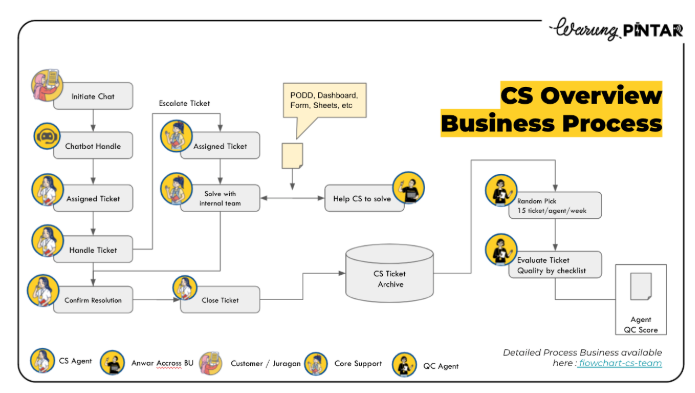

# Distribution Systems
**Company**: Sinbad
**Tags**: Sinbad, Systems
**Description**: Managed end-to-end distribution systems (SFA & Intools) to support supplier operations.

---

# No-Code Ops Tools
**Company**: Sinbad
**Tags**: Sinbad, No-Code, Bubble
**Description**: Led iteration of Stock Management, POS, Consignment App, and Survey tools using Bubble.

---

# Promo Engine Revamp
**Company**: Sinbad
**Tags**: Sinbad, Automation
**Description**: Revamped promo engine for Dapur Cokelat, removing manual coding & enabling faster creation.

---

# Last Mile App MVP
**Company**: Sinbad
**Tags**: Sinbad, MVP, Logistics
**Description**: Built driver and manager ops tools to support same-day closing and route assignment.

---

# Unilever Data Bridge
**Company**: Sinbad
**Tags**: Sinbad, Integration
**Description**: Developed data bridge system enabling seamless purchase order integration.

---

# Image Recognition
**Company**: Sinbad
**Tags**: Sinbad, AI, Research
**Description**: Led research using Ultralytics to identify SKUs during canvassing in retail stores.

---

# Arisan Reshuffling
**Company**: Mapan
**Tags**: Mapan, Feature
**Description**: Initiated feature to prevent cancellation due to OOS & keep group-buying cycle running.

---

# KYC Platform
**Company**: Mapan
**Tags**: Mapan, Compliance, Identity
**Description**: Implemented KYC platform service with Dukcapil integration for compliance.

---

# Auth System Enhancement
**Company**: Mapan
**Tags**: Mapan, Security, Optimization
**Description**: Improved reliability from 90 to 95% while lowering login cost by 30%.

---

# Assistant-based Learning
**Company**: Pahamify
**Tags**: Pahamify, EdTech, Growth
**Description**: Led product iteration used by more than 100k users.

---

# Video Publishing
**Company**: Pahamify
**Tags**: Pahamify, Workflow
**Description**: Cut upload time by 50%+ by streamlining video publishing into single-step upload.

---

# Clevertap Journey
**Company**: Pahamify
**Tags**: Pahamify, Marketing, Analytics
**Description**: Designed targeted journey lifting paid user conversion from 1% -> 2.2%.

---

# CS Ops Metrics
**Company**: Warung Pintar
**Tags**: Warung Pintar, Operations
**Description**: Established metrics reducing response time from >15 min to <5 min.

---

# Chatbot Optimization
**Company**: Warung Pintar
**Tags**: Warung Pintar, Automation, AI
**Description**: Iterated chatbot solutions, cutting >50% repetitive inquiries.

---

# Telesales Lead Optimization
**Company**: Warung Pintar
**Tags**: Warung Pintar, Sales
**Description**: Optimized lead data via query/rotation, increasing leads and conversion.
